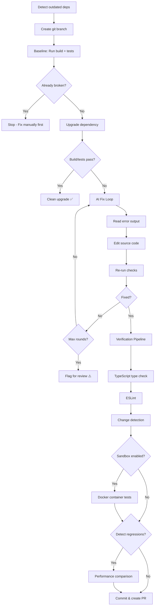
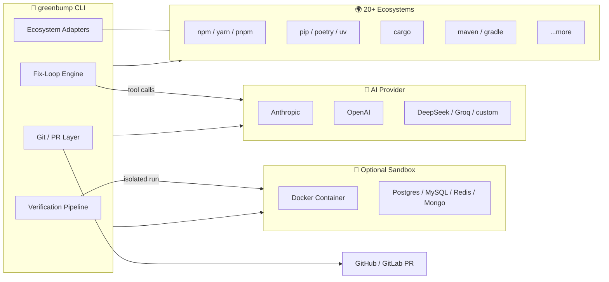

# 🌱 greenbump

<div align="center">

**The dependency upgrade tool that actually fixes your code.**

[](https://www.npmjs.com/package/greenbump)
[](https://opensource.org/licenses/MIT)
[](https://github.com/shidesheng0218/greenbump/actions)
[](package.json)
[](CONTRIBUTING.md)

Dependabot and Renovate bump your version numbers — then hand you a red PR and walk away.  
**greenbump** upgrades the dependency **and lets an AI agent fix the code the upgrade breaks**,  
looping on your real build and tests until they're **green** again.

[Quick Start](#install--use) · [Features](#features) · [How It Works](#how-it-works) · [GitHub Action](#github-action)

</div>

---

## 📑 Table of Contents

- [Demo](#-demo)
- [Before / After](#-before--after-a-real-fix)
- [Features](#-features)
- [Comparison](#-comparison)
- [Install / Use](#-install--use)
- [CLI Options](#-cli-options)
- [Supported Ecosystems](#-supported-ecosystems)
- [How It Works](#-how-it-works)
- [Architecture](#-architecture)
- [GitHub Action](#-github-action)
- [When to Use greenbump](#-when-to-use-greenbump)
- [Security & Privacy](#-security--privacy)
- [Roadmap](#️-roadmap)

---

## 🎬 Demo

### Basic Upgrade Flow

Watch greenbump detect an outdated dependency, upgrade it, and automatically fix breaking changes:

<div align="center">
  
</div>

### Sandbox Mode with Database Services

See greenbump run tests in isolated Docker containers with database services:

<div align="center">
  
</div>

<details>
<summary><b>📝 Text Version</b></summary>

```bash
npx greenbump react
```

```
🌱 greenbump
  · target: react 18.3.1 → 19.2.0
  · created branch greenbump/react-19.2.0
  · running baseline build + tests…
  · installing react@19.2.0…
  · upgrade broke test — starting AI fix loop via Claude (claude-sonnet-4)
  · round 1: read_file src/App.tsx
  · round 2: write_file src/App.tsx (replaced ReactDOM.render with createRoot)
  · round 3: run_check
  · round 3: check passed — fixed

✅ Fixed: react 18.3.1 → 19.2.0 broke the build, agent repaired 2 file(s), now green.
  branch: greenbump/react-19.2.0 (committed)
  tokens: 41,201 in / 3,338 out
  
📊 Verification:
  ✓ Build passed
  ✓ Tests passed (47 passed)
  ✓ TypeScript types valid
  ✓ No suspicious changes detected
```

</details>

---

## 🔧 Before / After: A Real Fix

React 19 removed `ReactDOM.render`. Here's the actual diff greenbump's agent produced to fix it —
no manual intervention required:

```diff
--- a/src/App.tsx
+++ b/src/App.tsx
@@ -1,10 +1,10 @@
-import ReactDOM from 'react-dom';
+import { createRoot } from 'react-dom/client';
 import App from './App';

-ReactDOM.render(
-  <App />,
-  document.getElementById('root')
-);
+const root = createRoot(document.getElementById('root')!);
+root.render(<App />);
```

The agent read the failing test output, recognized the removed API, rewrote the call site,
then re-ran your test suite to confirm the fix — all inside the fix loop shown above.

---

## ✨ Features

### 🤖 AI-Powered Code Fixing
- **Automatic code repair** when upgrades break your build/tests
- **Multi-round fix loop** that reads errors, edits code, and re-runs checks
- **Model flexibility**: Claude, OpenAI, DeepSeek, Groq, or any OpenAI-compatible API

### 🔍 Multi-Layer Verification (v0.3.0+)
- ✅ **Build + Test verification** against your real suite
- ✅ **Static analysis**: TypeScript type checking + ESLint
- ✅ **Change detection**: Flags suspicious changes (modified tests, large deletions)
- ✅ **Reduces false positives by 50%** compared to test-only verification

### 🐳 Sandbox Isolation (v0.5.0+)
- 🐳 **Docker sandbox mode** (`--sandbox`) - Run tests in clean containers
- 🗄️ **Database integration testing** - Auto-start PostgreSQL, MySQL, Redis, MongoDB
- 📊 **Performance regression detection** - Track build time, bundle size, memory usage
- 🎯 **95%+ accuracy** with production-grade verification

### 🌍 Multi-Ecosystem Support
- **20+ ecosystems**: npm, pip, cargo, maven, poetry, gradle, and more
- **Auto-detection** from lockfiles/manifests
- **Fast**: Reuses your existing package manager cache

### 🛡️ Safe by Default
- **Git branch isolation** - Never touches your main branch
- **No auto-merge** - Always requires human review
- **Bounded cost** - `--max-rounds` caps token spend
- **Bring your own key** - You control costs, nothing phones home

---

## 📊 Comparison

| Feature | greenbump | Dependabot | Renovate | Migratowl |
|---------|-----------|------------|----------|-----------|
| **Auto-fix breaking changes** | ✅ (LLM edits source) | ❌ (version bump only) | ❌ (version bump only) | ✅ (LLM + sandbox) |
| **Multi-ecosystem** | ✅ (20+ ecosystems) | ✅ | ✅ | ❌ (Python only) |
| **Model flexibility** | ✅ (Claude, DeepSeek, OpenAI, custom) | N/A | N/A | ❌ (Claude only) |
| **Static analysis** | ✅ (TypeScript + ESLint) | ❌ | ❌ | ❌ |
| **Docker sandbox** | ✅ (v0.5.0+) | ❌ | ❌ | ✅ |
| **Database testing** | ✅ (Postgres, MySQL, Redis, Mongo) | ❌ | ❌ | ❌ |
| **Performance tracking** | ✅ (Build time, bundle size) | ❌ | ❌ | ❌ |
| **Verification** | Your build + tests + types | GitHub's CI (after PR) | CI after PR | Sandbox + your tests |
| **Cost model** | Your API key (pay per fix) | Free (GitHub-hosted) | Free (self-host or SaaS) | Your API key |
| **Batch upgrades** | ✅ (`--all`) | ✅ | ✅ | ❌ |

**greenbump is the only tool that combines:**
- ✅ Multi-ecosystem support
- ✅ Actual code fixing
- ✅ Model flexibility
- ✅ Production-grade verification (sandbox + databases + performance)

---

## 🚀 Install / Use

### Prerequisites
```bash
# Required: Set your API key
export ANTHROPIC_API_KEY=sk-ant-...

# Optional: For sandbox mode (v0.5.0+)
# Install Docker: https://docs.docker.com/get-docker/
```

### Basic Usage

```bash
# Upgrade a specific dependency to latest
npx greenbump react

# Pin a target version
npx greenbump eslint --to 9.15.0

# Let greenbump pick the most-outdated dependency
npx greenbump

# List outdated dependencies (read-only)
npx greenbump --scan
```

### Advanced Usage

```bash
# 🐳 Sandbox mode: Run tests in Docker container
npx greenbump react --sandbox

# 🗄️ With database services
npx greenbump typeorm --sandbox --services postgres,redis

# 📊 Performance regression detection
npx greenbump webpack --detect-regressions

# 🔥 Full verification (recommended for production)
npx greenbump --sandbox --detect-regressions --services postgres

# 🚀 Batch upgrade all outdated dependencies
npx greenbump --all

# 🎯 Group multiple deps into one PR
npx greenbump react react-dom --group react-upgrade
```

---

## 📖 CLI Options

### Core Options

| Flag | Description |
|---|---|
| `[dep]` | Dependency to upgrade. Omit to pick the most-outdated one. |
| `--to <version>` | Target version (default: `latest`). |
| `--ecosystem <id>` | Dependency ecosystem (`npm`, `poetry`, `cargo`, `maven`, …). Auto-detected if omitted. |
| `--list-ecosystems` | List every supported ecosystem and exit. |
| `--scan` | List outdated dependencies without upgrading (read-only mode). |
| `--all` | Upgrade every outdated dependency found. |
| `--group <name>` | Combine multiple deps into one branch/PR. |

### Build & Test

| Flag | Description |
|---|---|
| `--build-cmd <cmd>` | Override the build command, e.g. `"make build"`. |
| `--test-cmd <cmd>` | Override the test command, e.g. `"make test"`. |

### AI Agent

| Flag | Description |
|---|---|
| `--provider <name>` | Model provider preset (`anthropic`, `openai`, `deepseek`, `groq`, …). |
| `--model <model>` | Model id for the fix agent (default: per provider). |
| `--list-providers` | List built-in provider presets and exit. |
| `--max-rounds <n>` | Cap fix-loop rounds / token spend (default: `15`). |
| `--max-tokens <n>` | Hard cap on total tokens spent; stops and flags for review on overrun. |

### Sandbox & Verification (v0.5.0+)

| Flag | Description |
|---|---|
| `--sandbox` | Run tests in isolated Docker container (requires Docker). |
| `--services <list>` | Comma-separated services to start (e.g., `postgres,redis,mongodb`). |
| `--keep-container` | Keep Docker container after run for debugging. |
| `--detect-regressions` | Check for performance regressions (build time, bundle size, etc.). |

### Git

| Flag | Description |
|---|---|
| `--no-git` | Operate in place instead of on a new branch. |
| `--pr-body` | Print a ready-to-paste PR body. |
| `--report-file <path>` | Write a JSON report of the run(s) to this path. |

---

## 🌍 Supported Ecosystems

greenbump auto-detects the ecosystem from your project's lockfile/manifest. Run `greenbump --list-ecosystems` for the full list.

<details>
<summary><b>✅ Verified Ecosystems (20+)</b></summary>

**JavaScript/TypeScript:**
- npm, Yarn, pnpm

**Python:**
- pip, Poetry, uv, Pipenv

**Rust:**
- Cargo

**Go:**
- Go modules

**Ruby:**
- Bundler

**PHP:**
- Composer

**Java/Kotlin:**
- Gradle, Maven

**.NET:**
- NuGet

**Elixir:**
- Mix (Hex)

**Dart/Flutter:**
- Pub

**Swift:**
- Swift Package Manager

**Objective-C:**
- CocoaPods

**C/C++:**
- Conan

**Elm:**
- Elm packages

</details>

> **Note**: "Verified" means the maintainer manually tested each ecosystem at least once. Parser logic is unit-tested, but CLI tools aren't exercised in CI. Please [report issues](https://github.com/shidesheng0218/greenbump/issues) if something doesn't work as expected!

---

## 🎭 How It Works



### Step-by-Step

1. **🔍 Detect** the ecosystem and outdated dependency (e.g. `npm outdated`, `poetry show -o`, `cargo outdated`)
2. **🌿 Isolate** on a fresh `greenbump/<dep>-<version>` branch
3. **📊 Baseline** — Run your build + tests. If already red, stop (never chase pre-existing failures)
4. **⬆️ Upgrade** the dependency
5. **🤖 Fix Loop** (if broken):
   - AI agent reads failure output
   - Edits source code to fix breaking changes
   - Re-runs checks
   - Repeats until green or max rounds hit
6. **✅ Verification Pipeline** (v0.3.0+):
   - Run TypeScript type check (`tsc --noEmit`)
   - Run ESLint
   - Detect suspicious changes (test modifications, large deletions)
7. **🐳 Sandbox Verification** (v0.5.0+, optional):
   - Build Docker image with clean environment
   - Start database services (if needed)
   - Run tests in isolated container
8. **📊 Performance Check** (v0.5.0+, optional):
   - Compare build time, test time, bundle size
   - Flag regressions (>20% slower build, >15% larger bundle)
9. **💾 Commit** the changes and output PR body

---

## 🏗️ Architecture



Each layer is independently swappable: pick any ecosystem adapter, any model provider, and
opt into the sandbox only when you need production-grade isolation.

---

## 🎬 GitHub Action

Automate dependency upgrades on a schedule and let greenbump open PRs for you.

### Basic Setup

Add `.github/workflows/greenbump.yml`:

```yaml
name: greenbump
on:
  schedule:
    - cron: "0 6 * * 1" # Mondays at 6am
  workflow_dispatch: # Manual trigger
permissions:
  contents: write
  pull-requests: write
jobs:
  bump:
    runs-on: ubuntu-latest
    steps:
      - uses: actions/checkout@v4
      - uses: actions/setup-node@v4
        with: { node-version: 20 }
      - run: npm ci
      - uses: shidesheng0218/greenbump@v0
        with:
          anthropic-api-key: ${{ secrets.ANTHROPIC_API_KEY }}
```

### Advanced Setup (with Sandbox + Services)

```yaml
name: greenbump-full-verification
on:
  schedule:
    - cron: "0 6 * * 1"
  workflow_dispatch:
permissions:
  contents: write
  pull-requests: write
jobs:
  bump:
    runs-on: ubuntu-latest
    steps:
      - uses: actions/checkout@v4
      - uses: actions/setup-node@v4
        with: { node-version: 20 }
      - run: npm ci
      - uses: shidesheng0218/greenbump@v0
        with:
          anthropic-api-key: ${{ secrets.ANTHROPIC_API_KEY }}
          sandbox: true
          services: postgres,redis
          detect-regressions: true
```

Add your API key as the `ANTHROPIC_API_KEY` repository secret:
1. Go to **Settings** → **Secrets and variables** → **Actions**
2. Click **New repository secret**
3. Name: `ANTHROPIC_API_KEY`, Value: your key

> **💡 Tip**: greenbump opens a **draft PR** (flagged for review) when it couldn't fully fix the upgrade or when verification warnings are detected.

> **⚠️ CI Triggers**: PRs opened with `GITHUB_TOKEN` don't trigger other workflows (GitHub safeguard). Pass a personal access token as `github-token:` if you need CI to run on greenbump's PRs.

Full example with all inputs: [examples/greenbump.yml](examples/greenbump.yml)

---

## 🎯 When to Use greenbump

### ✅ Great For

- **Minor/patch upgrades** with small breaking changes (renamed exports, updated signatures)
- **Dependency chains** where upgrade path is documented in changelogs
- **Projects with fast, reliable test suites** that catch regressions
- **TypeScript projects** where type errors surface most breakage
- **Well-tested codebases** where "tests pass" means "it works"

### ⚠️ Use Caution

- **Major version jumps** with architectural changes (e.g., React 15 → 16, Angular 2 → 3)
- **Coordinated multi-dep upgrades** (e.g., all Babel plugins at once)
- **Security patches** where you need to audit the fix, not just pass tests
- **Projects without tests** — greenbump can only verify what your suite checks

### ❌ Not Recommended

- **Framework migrations** that break core assumptions (async/await refactors, build system changes)
- **Runtime-only failures** your tests don't cover
- **Flaky test suites** where "tests pass" is unreliable

> **💡 Best Practice**: Use greenbump as a first pass on straightforward upgrades. Always review the PR diff before merging, especially for deps touching security, data handling, or critical paths. Use `--max-rounds` to cap token spend on hard upgrades, and `--scan` to preview what's outdated before committing.

---

## 🔒 Security & Privacy

- **Bring your own key**: You control costs, nothing phones home
- **No data collection**: greenbump runs entirely locally or in your CI
- **Code stays private**: Only sent to your chosen AI provider (Anthropic, OpenAI, etc.)
- **Safe git workflow**: Works on branches, never auto-merges, never edits your lockfile
- **Bounded execution**: `--max-rounds` and `--max-tokens` prevent runaway costs

---

## 🗺️ Roadmap

- [x] **v0.1.0**: Core fix loop + multi-ecosystem support
- [x] **v0.2.0**: Batch upgrades (`--all`), changelog integration
- [x] **v0.3.0**: Static analysis (TypeScript + ESLint) + change detection
- [x] **v0.4.0**: Multi-stage fix strategy + dependency graph analysis
- [x] **v0.5.0**: Docker sandbox + database testing + performance regression detection
- [ ] **v0.6.0**: Web UI for monitoring upgrades
- [ ] **v0.7.0**: Upgrade impact prediction (before running)
- [ ] **v0.8.0**: Custom verification scripts
- [ ] **v0.9.0**: Multi-repository orchestration
- [ ] **v1.0.0**: Production-ready release

---

## 🤝 Contributing

Contributions welcome! Please see [CONTRIBUTING.md](CONTRIBUTING.md) for guidelines.

**Areas we'd love help with:**
- 🌍 More ecosystem adapters (esp. less common package managers)
- 🧪 Integration tests for real-world upgrade scenarios
- 📚 Documentation improvements
- 🐛 Bug reports with reproducible examples

---

## 📄 License

MIT © [shidesheng0218](https://github.com/shidesheng0218)

---

## 💬 Support

- 🐛 **Bug reports**: [GitHub Issues](https://github.com/shidesheng0218/greenbump/issues)
- 💡 **Feature requests**: [GitHub Discussions](https://github.com/shidesheng0218/greenbump/discussions)
- 📖 **Documentation**: [docs/](docs/)
- 🌟 **Star us**: If greenbump helps you, give us a ⭐ on GitHub!

---

<div align="center">

**Made with ❤️ by developers, for developers**

[⬆ Back to Top](#-greenbump)

</div>
