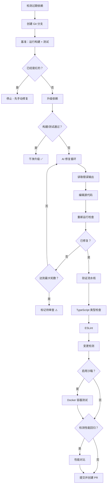
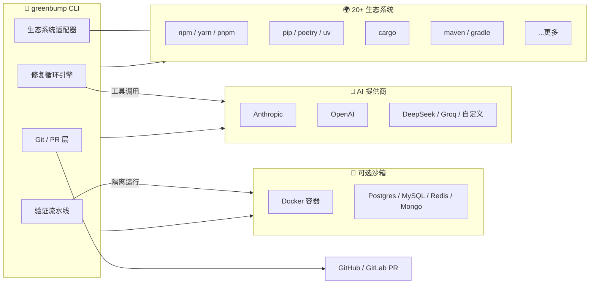

# 🌱 greenbump

<div align="center">

[English](README.md) | 简体中文

**真正能修复代码的依赖升级工具。**

[](https://www.npmjs.com/package/greenbump)
[](https://opensource.org/licenses/MIT)
[](https://github.com/shidesheng0218/greenbump/actions)
[](package.json)
[](CONTRIBUTING.md)

Dependabot 和 Renovate 只会升级版本号，然后给你一个失败的 PR 就不管了。
**greenbump** 不仅升级依赖，**还会让 AI 智能体修复升级导致的代码问题**，
在你真实的构建和测试上循环迭代，直到**全部通过**。

</div>

---

## 📑 目录

- [演示](#-演示)
- [修复前后对比](#-修复前后一次真实的修复)
- [特性](#-特性)
- [对比](#-对比)
- [快速开始](#-快速开始)
- [CLI 选项](#-cli-选项)
- [支持的包管理器](#-支持的包管理器)
- [工作原理](#-工作原理)
- [架构](#️-架构)
- [GitHub Actions](#-github-actions)
- [适用场景](#-适用场景)
- [安全与隐私](#-安全与隐私)
- [路线图](#️-路线图)
- [贡献](#-贡献)
- [许可证](#-许可证)
- [常见问题](#-常见问题)

---

## 🎬 演示

```bash
npx greenbump react
```

```
🌱 greenbump
  · 目标：react 18.3.1 → 19.2.0
  · 创建分支 greenbump/react-19.2.0
  · 运行基准构建和测试…
  · 安装 react@19.2.0…
  · 升级破坏了测试 — 启动 AI 修复循环（claude-sonnet-4）
  · 第 1 轮：read_file src/App.tsx
  · 第 2 轮：write_file src/App.tsx（将 ReactDOM.render 替换为 createRoot）
  · 第 3 轮：run_check
  · 第 3 轮：检查通过 — 已修复

✅ 修复完成：react 18.3.1 → 19.2.0 破坏了构建，智能体修复了 2 个文件，现已通过。
  分支：greenbump/react-19.2.0（已提交）
  令牌用量：41,201 输入 / 3,338 输出

📊 验证结果：
  ✓ 构建通过
  ✓ 测试通过（47 个通过）
  ✓ TypeScript 类型有效
  ✓ 未检测到可疑变更
```

---

## 🔧 修复前后：一次真实的修复

React 19 移除了 `ReactDOM.render`。下面是 greenbump 智能体为修复该问题实际生成的 diff——
全程无需人工介入：

```diff
--- a/src/App.tsx
+++ b/src/App.tsx
@@ -1,10 +1,10 @@
-import ReactDOM from 'react-dom';
+import { createRoot } from 'react-dom/client';
 import App from './App';

-ReactDOM.render(
-  <App />,
-  document.getElementById('root')
-);
+const root = createRoot(document.getElementById('root')!);
+root.render(<App />);
```

智能体读取了失败的测试输出，识别出被移除的 API，重写了调用点，
然后重新运行测试套件确认修复——整个过程都在上面展示的修复循环内完成。

---

## ✨ 特性

### 🤖 AI 驱动的代码修复
- **自动代码修复** — 当升级破坏你的构建/测试时自动介入
- **多轮修复循环** — 读取错误、编辑代码、重新运行检查
- **模型灵活性**：Claude、OpenAI、DeepSeek、Groq 或任何兼容 OpenAI 接口的服务

### 🔍 多层验证（v0.3.0+）
- ✅ **构建 + 测试验证** — 针对你真实的测试套件
- ✅ **静态分析**：TypeScript 类型检查 + ESLint
- ✅ **变更检测**：标记可疑变更（修改测试、大量删除代码）
- ✅ **相比仅依赖测试，误报率降低 50%**

### 🐳 沙箱隔离（v0.5.0+）
- 🐳 **Docker 沙箱模式**（`--sandbox`）— 在干净的容器中运行测试
- 🗄️ **数据库集成测试** — 自动启动 PostgreSQL、MySQL、Redis、MongoDB
- 📊 **性能回归检测** — 追踪构建时间、包体积、内存占用
- 🎯 **95%+ 准确率** — 生产级验证

### 🌍 多生态系统支持
- **20+ 生态系统**：npm、pip、cargo、maven、poetry、gradle 等
- **自动检测** — 根据 lockfile/manifest 自动识别
- **速度快** — 复用你现有的包管理器缓存

### 🛡️ 默认安全
- **Git 分支隔离** — 绝不触碰你的主分支
- **不自动合并** — 始终需要人工审查
- **成本可控** — `--max-rounds` 限制令牌消耗
- **自带密钥** — 你掌控成本，数据不会外泄

---

## 📊 对比

| 特性 | greenbump | Dependabot | Renovate | Migratowl |
|---------|-----------|------------|----------|-----------|
| **自动修复破坏性变更** | ✅（LLM 编辑源码） | ❌（仅升级版本号） | ❌（仅升级版本号） | ✅（LLM + 沙箱） |
| **多生态系统** | ✅（20+ 生态系统） | ✅ | ✅ | ❌（仅 Python） |
| **模型灵活性** | ✅（Claude、DeepSeek、OpenAI、自定义） | 不适用 | 不适用 | ❌（仅 Claude） |
| **静态分析** | ✅（TypeScript + ESLint） | ❌ | ❌ | ❌ |
| **Docker 沙箱** | ✅（v0.5.0+） | ❌ | ❌ | ✅ |
| **数据库测试** | ✅（Postgres、MySQL、Redis、Mongo） | ❌ | ❌ | ❌ |
| **性能追踪** | ✅（构建时间、包体积） | ❌ | ❌ | ❌ |
| **验证方式** | 你的构建 + 测试 + 类型检查 | GitHub 的 CI（PR 之后） | PR 之后的 CI | 沙箱 + 你的测试 |
| **成本模型** | 你自己的 API 密钥（按次付费） | 免费（GitHub 托管） | 免费（自建或 SaaS） | 你自己的 API 密钥 |
| **批量升级** | ✅（`--all`） | ✅ | ✅ | ❌ |

**greenbump 是唯一同时具备以下能力的工具：**
- ✅ 多生态系统支持
- ✅ 真正修复代码
- ✅ 模型灵活性
- ✅ 生产级验证（沙箱 + 数据库 + 性能）

---

## 🚀 快速开始

### 前置条件

```bash
# 必需：设置你的 API 密钥
export ANTHROPIC_API_KEY=sk-ant-...

# 可选：沙箱模式需要（v0.5.0+）
# 安装 Docker：https://docs.docker.com/get-docker/
```

### 基础用法

```bash
# 将某个依赖升级到最新版本
npx greenbump react

# 指定目标版本
npx greenbump eslint --to 9.15.0

# 不指定依赖，让 greenbump 自动选择最过期的一个
npx greenbump

# 列出过期依赖（只读模式，不做升级）
npx greenbump --scan
```

### 进阶用法

```bash
# 🐳 沙箱模式：在 Docker 容器中运行测试
npx greenbump react --sandbox

# 🗄️ 附带数据库服务
npx greenbump typeorm --sandbox --services postgres,redis

# 📊 性能回归检测
npx greenbump webpack --detect-regressions

# 🔥 完整验证（推荐用于生产环境）
npx greenbump --sandbox --detect-regressions --services postgres

# 🚀 批量升级所有过期依赖
npx greenbump --all

# 🎯 将多个依赖合并到一个 PR
npx greenbump react react-dom --group react-upgrade
```

---

## 📖 CLI 选项

### 核心选项

| 参数 | 说明 |
|---|---|
| `[dep]` | 要升级的依赖。省略时自动选择最过期的一个。 |
| `--to <version>` | 目标版本（默认：`latest`）。 |
| `--ecosystem <id>` | 依赖生态系统（`npm`、`poetry`、`cargo`、`maven` 等）。省略时自动检测。 |
| `--list-ecosystems` | 列出所有支持的生态系统并退出。 |
| `--scan` | 仅列出过期依赖，不执行升级（只读模式）。 |
| `--all` | 升级所有检测到的过期依赖。 |
| `--group <name>` | 将多个依赖合并到同一个分支/PR。 |

### 构建与测试

| 参数 | 说明 |
|---|---|
| `--build-cmd <cmd>` | 覆盖构建命令，例如 `"make build"`。 |
| `--test-cmd <cmd>` | 覆盖测试命令，例如 `"make test"`。 |

### AI 智能体

| 参数 | 说明 |
|---|---|
| `--provider <name>` | 模型提供商预设（`anthropic`、`openai`、`deepseek`、`groq` 等）。 |
| `--model <model>` | 修复智能体使用的模型 id（默认：各提供商的默认模型）。 |
| `--list-providers` | 列出内置的提供商预设并退出。 |
| `--max-rounds <n>` | 限制修复循环的轮数/令牌消耗（默认：`15`）。 |
| `--max-tokens <n>` | 令牌总消耗硬上限；超出后停止并标记为待审查。 |

### 沙箱与验证（v0.5.0+）

| 参数 | 说明 |
|---|---|
| `--sandbox` | 在隔离的 Docker 容器中运行测试（需要 Docker）。 |
| `--services <list>` | 逗号分隔的服务列表（例如 `postgres,redis,mongodb`）。 |
| `--keep-container` | 运行结束后保留 Docker 容器，便于调试。 |
| `--detect-regressions` | 检测性能回归（构建时间、包体积等）。 |

### 成本与信任（v0.6.0+）

| 参数 | 说明 |
|---|---|
| `-i`, `--interactive` | 交互模式：每个 AI 提议的修改以彩色 diff 展示，确认后才写入。接受（`y`）、拒绝（`n`）、跳过（`s`）、全部接受（`a`）或手动编辑（`e`）。 |
| `--no-free-tiers` | 跳过免费修复层级（codemod / 学习模式 / 缓存），直接调用 LLM。 |
| `--no-cache` | 完全禁用 changelog / 修复缓存。 |
| `--no-ast-analysis` | 禁用修复后的 API 表面分析（导出删除、签名变更、新增 `any`）。 |
| `--list-codemods` | 列出所有内置免费 codemod 并退出。 |
| `--cache-stats` | 显示缓存条目数、体积及分类统计。 |
| `--cache-clear [category]` | 清除缓存条目（`changelogs`、`llm-fixes`、`patterns`；省略则全部清除）。 |

#### 分层修复策略如何降低成本

升级导致构建失败时，greenbump 按成本从低到高依次尝试四个修复层级：

| 层级 | 策略 | 成本 |
|---|---|---|
| 1 | **内置 codemod** —— 针对知名 Breaking Change 的正则转换（React 18→19、Vue 2→3 等） | 0 token |
| 2 | **学习模式** —— 历史成功修复提炼为可复用规则 | 0 token |
| 3 | **缓存的 LLM 修复** —— 相同的失败上下文直接重放之前的修复 | 0 token |
| 4 | **LLM 修复循环** —— 完整的 AI 代理，仅在前三层未命中时启用 | 付费 |

端到端验证：React 18→19 升级（`ReactDOM.render` → `createRoot`）由第 1 层修复，**消耗 0 输入 / 0 输出 token**。成功的 LLM 修复会被学习进缓存，因此跨项目的重复失败同样免费。

### Git

| 参数 | 说明 |
|---|---|
| `--no-git` | 直接在当前工作区操作，不创建新分支。 |
| `--pr-body` | 打印一份可直接粘贴使用的 PR 正文。 |
| `--report-file <path>` | 将运行结果的 JSON 报告写入该路径。 |

---

## 🌍 支持的包管理器

greenbump 会根据项目的 lockfile/manifest 自动检测生态系统。运行 `greenbump --list-ecosystems` 查看完整列表。

<details>
<summary><b>✅ 已验证的生态系统（20+）</b></summary>

**JavaScript/TypeScript：**
- npm、Yarn、pnpm

**Python：**
- pip、Poetry、uv、Pipenv

**Rust：**
- Cargo

**Go：**
- Go modules

**Ruby：**
- Bundler

**PHP：**
- Composer

**Java/Kotlin：**
- Gradle、Maven

**.NET：**
- NuGet

**Elixir：**
- Mix（Hex）

**Dart/Flutter：**
- Pub

**Swift：**
- Swift Package Manager

**Objective-C：**
- CocoaPods

**C/C++：**
- Conan

**Elm：**
- Elm packages

</details>

> **说明**：“已验证”表示维护者至少手动测试过一次该生态系统。解析逻辑有单元测试覆盖，但 CLI 工具本身未在 CI 中运行。如果遇到问题，欢迎 [反馈](https://github.com/shidesheng0218/greenbump/issues)！

---

## 🎭 工作原理



### 分步说明

1. **🔍 检测** 生态系统和过期依赖（例如 `npm outdated`、`poetry show -o`、`cargo outdated`）
2. **🌿 隔离** 在全新的 `greenbump/<dep>-<version>` 分支上操作
3. **📊 基准测试** — 运行你的构建 + 测试。如果已经是红的，停止（绝不追着已存在的失败跑）
4. **⬆️ 升级** 目标依赖
5. **🤖 修复循环**（如果被破坏）：
   - AI 智能体读取失败输出
   - 编辑源代码修复破坏性变更
   - 重新运行检查
   - 循环直到通过或达到最大轮数
6. **✅ 验证流水线**（v0.3.0+）：
   - 运行 TypeScript 类型检查（`tsc --noEmit`）
   - 运行 ESLint
   - 检测可疑变更（测试被修改、大量删除代码）
7. **🐳 沙箱验证**（v0.5.0+，可选）：
   - 使用干净环境构建 Docker 镜像
   - 启动所需的数据库服务
   - 在隔离容器中运行测试
8. **📊 性能检查**（v0.5.0+，可选）：
   - 对比构建时间、测试时间、包体积
   - 标记回归（构建变慢 >20%、包体积增大 >15%）
9. **💾 提交** 变更并输出 PR 正文

---

## 🏗️ 架构



每一层都可以独立替换：任选生态系统适配器、任选模型提供商，
只有在需要生产级隔离时才启用沙箱。

---

## 🎬 GitHub Actions

按计划自动升级依赖，让 greenbump 帮你开 PR。

### 基础配置

新建 `.github/workflows/greenbump.yml`：

```yaml
name: greenbump
on:
  schedule:
    - cron: "0 6 * * 1" # 每周一早上 6 点
  workflow_dispatch: # 手动触发
permissions:
  contents: write
  pull-requests: write
jobs:
  bump:
    runs-on: ubuntu-latest
    steps:
      - uses: actions/checkout@v4
      - uses: actions/setup-node@v4
        with: { node-version: 20 }
      - run: npm ci
      - uses: shidesheng0218/greenbump@v0
        with:
          anthropic-api-key: ${{ secrets.ANTHROPIC_API_KEY }}
```

### 进阶配置（含沙箱 + 服务）

```yaml
name: greenbump-full-verification
on:
  schedule:
    - cron: "0 6 * * 1"
  workflow_dispatch:
permissions:
  contents: write
  pull-requests: write
jobs:
  bump:
    runs-on: ubuntu-latest
    steps:
      - uses: actions/checkout@v4
      - uses: actions/setup-node@v4
        with: { node-version: 20 }
      - run: npm ci
      - uses: shidesheng0218/greenbump@v0
        with:
          anthropic-api-key: ${{ secrets.ANTHROPIC_API_KEY }}
          sandbox: true
          services: postgres,redis
          detect-regressions: true
```

添加 `ANTHROPIC_API_KEY` 仓库 secret：
1. 进入 **Settings** → **Secrets and variables** → **Actions**
2. 点击 **New repository secret**
3. 名称：`ANTHROPIC_API_KEY`，值：你的密钥

> **💡 提示**：当 greenbump 无法完全修复升级问题或验证出现警告时，会开一个 **draft PR**（标记为待审查）。

> **⚠️ CI 触发限制**：使用 `GITHUB_TOKEN` 打开的 PR 不会触发其他 workflow（GitHub 的安全机制）。如果需要 CI 在 greenbump 的 PR 上运行，请通过 `github-token:` 传入一个 personal access token。

完整示例（包含所有输入项）：[examples/greenbump.yml](examples/greenbump.yml)

---

## 🎯 适用场景

### ✅ 非常适合

- **小版本/补丁升级**，破坏性变更较小（重命名导出、签名更新）
- **依赖链升级**，升级路径在 changelog 中有文档说明
- **测试快速可靠的项目**，能及时捕获回归
- **TypeScript 项目**，类型错误能暴露大部分破坏性变更
- **测试覆盖良好的代码库**，“测试通过”确实意味着“功能正常”

### ⚠️ 需要谨慎

- **大版本跨越且伴随架构变更**（例如 React 15 → 16、Angular 2 → 3）
- **多依赖协同升级**（例如一次性升级所有 Babel 插件）
- **安全补丁**，需要审计修复内容而不只是通过测试
- **没有测试的项目** — greenbump 只能验证测试套件覆盖到的部分

### ❌ 不建议使用

- **破坏核心假设的框架迁移**（async/await 重构、构建系统变更）
- **测试无法覆盖的运行时问题**
- **不稳定的测试套件**，“测试通过”本身不可靠

> **💡 最佳实践**：将 greenbump 用作简单升级的第一道处理。合并前始终审查 PR diff，尤其是涉及安全、数据处理或关键路径的依赖。用 `--max-rounds` 限制困难升级的令牌消耗，用 `--scan` 在动手前预览有哪些依赖已过期。

---

## 🔒 安全与隐私

- **自带密钥**：你掌控成本，数据不会外泄
- **不收集数据**：greenbump 完全在本地或你的 CI 中运行
- **代码保持私密**：仅发送给你选择的 AI 提供商（Anthropic、OpenAI 等）
- **安全的 Git 工作流**：只在分支上操作，绝不自动合并，绝不修改你的 lockfile
- **执行有边界**：`--max-rounds` 和 `--max-tokens` 防止失控消耗

**关键安全边界：**
- AI 智能体只能访问项目目录内的文件（路径遍历保护）
- 所有文件操作都经过 `safePath()` 验证
- 智能体不能执行任意 shell 命令
- 发送给 AI 提供商的数据：错误日志、diff、文件内容（不包含 secrets）

如果你发现安全漏洞，请查看 [SECURITY.md](SECURITY.md) 了解如何负责任地报告。

---

## 🗺️ 路线图

- [x] **v0.1.0**：核心修复循环 + 多生态系统支持
- [x] **v0.2.0**：批量升级（`--all`）、changelog 集成
- [x] **v0.3.0**：静态分析（TypeScript + ESLint）+ 变更检测
- [x] **v0.4.0**：多阶段修复策略 + 依赖图分析
- [x] **v0.5.0**：Docker 沙箱 + 数据库测试 + 性能回归检测
- [ ] **v0.6.0**：用于监控升级的 Web UI
- [ ] **v0.7.0**：升级影响预测（运行前预判）
- [ ] **v0.8.0**：自定义验证脚本
- [ ] **v0.9.0**：多仓库编排
- [ ] **v1.0.0**：生产可用版本

---

## 🤝 贡献

欢迎贡献代码！请参阅 [CONTRIBUTING.md](CONTRIBUTING.md) 了解指南。

**我们特别需要帮助的方向：**
- 🌍 更多生态系统适配器（尤其是小众包管理器）
- 🧪 针对真实升级场景的集成测试
- 📚 文档改进
- 🐛 附带可复现步骤的 Bug 报告

---

## 📄 许可证

MIT © [shidesheng0218](https://github.com/shidesheng0218)

---

## 常见问题

**Q: greenbump 和 Renovate/Dependabot 有什么区别？**

A: Renovate 和 Dependabot 只升级版本号。如果升级破坏了代码（例如 API 变更），它们会创建一个失败的 PR，由你来修复。greenbump 使用 AI 智能体自动修复破坏性变更，循环运行测试直到通过。

**Q: AI 修复需要多长时间？**

A: 取决于破坏的复杂度。简单的 API 重命名通常 1-2 轮（30-60 秒）。复杂的架构变更可能需要 5-10 轮（2-5 分钟）。你可以用 `--max-rounds` 限制。

**Q: 费用是多少？**

A: 使用你自己的 API 密钥，按 AI 提供商的定价付费。典型的修复消耗 10k-50k tokens（Claude Sonnet 约 $0.15-$0.75）。可以用 `--max-tokens` 设置预算上限。

**Q: 支持私有包吗？**

A: 支持。greenbump 使用你本地的包管理器配置，如果 `npm install` 能访问你的私有 registry，greenbump 也能。

**Q: 能修复所有破坏性变更吗？**

A: 不能保证。AI 能处理大多数常见的 API 变更、导入重命名、配置更新等。对于需要深度架构改动的变更可能会达到 `--max-rounds` 限制。你总是可以在智能体的工作基础上继续手动修复。

**Q: 安全吗？**

A: 智能体被限制在项目目录内，不能执行任意命令。但它**会修改你的代码**，所以：
- 建议在干净的 git 工作树上运行（有未提交的变更会被拒绝）
- 合并前审查修复后的 PR
- 先在非关键分支上测试
- 查看 [SECURITY.md](SECURITY.md) 了解完整的安全模型

---

## 💬 支持与反馈

- 🐛 **Bug 反馈**：[GitHub Issues](https://github.com/shidesheng0218/greenbump/issues)
- 💡 **功能建议**：[GitHub Discussions](https://github.com/shidesheng0218/greenbump/discussions)
- 📖 **文档**：[docs/](docs/)
- 🌟 **点个 Star**：如果 greenbump 对你有帮助，欢迎在 GitHub 上点个 ⭐！

开发者：[@shidesheng0218](https://github.com/shidesheng0218)

---

<div align="center">

**Made with ❤️ by developers, for developers**

[⬆ 回到顶部](#-greenbump)

</div>
